# FestFuse

**A festival discovery and planning app that helps you decide who to see before the gates open.**

[Live Demo](https://festfuse.com/) · [Architecture](ARCHITECTURE.md)

> FestFuse currently features the Lollapalooza 2026 lineup. Support for additional festivals is planned.

Designed and built solo: product design, full-stack development, and artist data curation across 171 artists and 4 festival days.

<p align="center">
  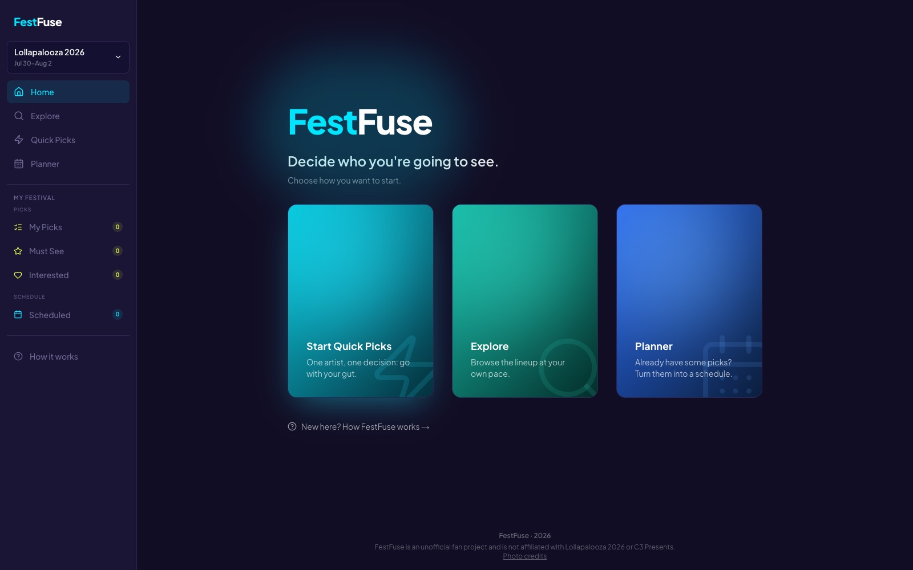
  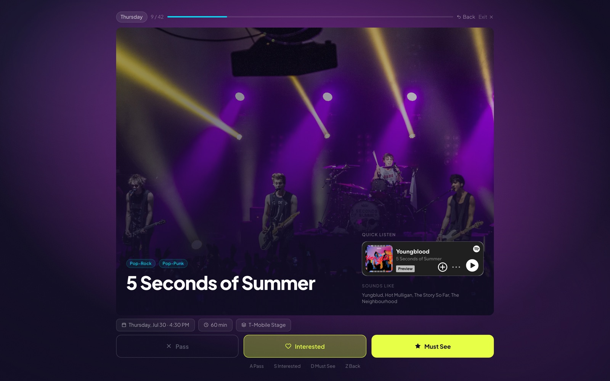
</p>

## Why FestFuse?

Festival lineups can turn music discovery into homework. FestFuse offers a few focused ways through it. Browse the lineup at your own pace, or move fast with one-at-a-time decisions in Quick Picks if manual browsing isn't your style. Turn your picks into a schedule whenever you're ready to plan, and get a personalized recap of your festival taste once you've made enough picks.

The goal is not to catalog everything about every artist. It is to help festivalgoers feel confident and excited about who they choose to see.

## Features

- **Explore**

  Browse the lineup through themed rows like Festival Favorites, search by artist, genre, location, or stage, and filter by genre, day, stage, pick status, or schedule status.

- **Artist Page**

  Learn what an artist sounds like through editorial context, Spotify listening, live-performance video, albums, and similar lineup artists.

- **Quick Picks**

  Review artists one at a time, with a Quick Listen preview and similar-artist suggestions for context, and choose _Pass_, _Interested_, or _Must See_, with the option to step back and revisit your last call.

- **Planner**

  Turn your picks into a day-and-stage schedule, with scheduling conflicts flagged automatically.

- **Festival Story**

  A personalized, Wrapped-style recap of your listening preferences and festival priorities, revealed once enough picks are made.

- **Persistent progress**

  Keep picks, attendance days, planner selections, and scheduling decisions across browser sessions.

- **Responsive experience**

  Use the core discovery and planning flows across desktop and mobile layouts.

## Screens

**Explore**

The Festival Favorites carousel, with picks and a schedule conflict visible on the cards.

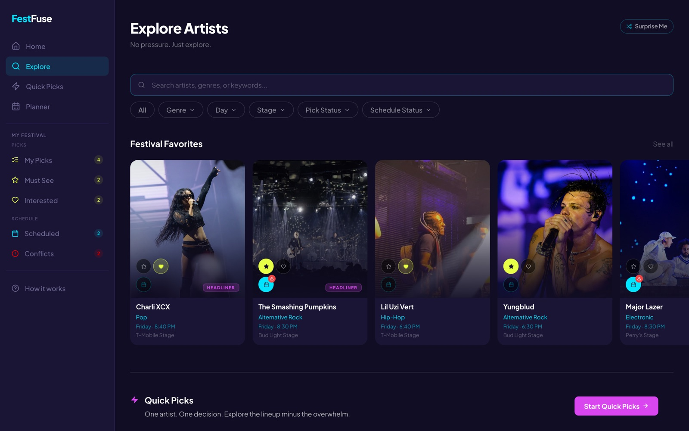

**Artist Page**

Artist page for The Smashing Pumpkins, with Must See and Scheduled both marked active.

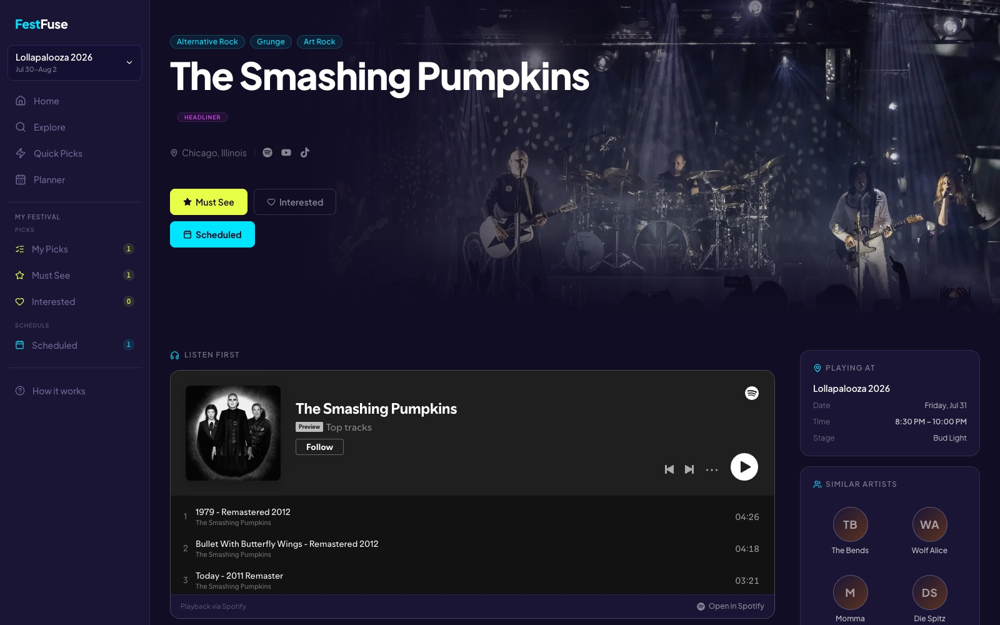

**Planner**

A snapshot of Friday's schedule, with several picks (some also scheduled) and a real schedule conflict.

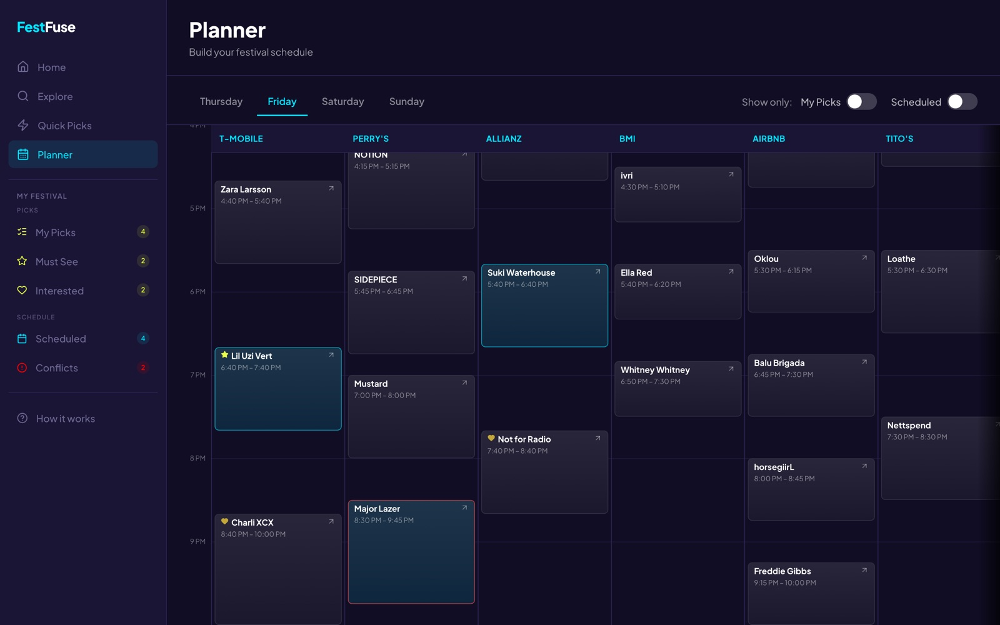

**Festival Story insight**

One of four insight cards, computed from the picks and interest levels selected during Quick Picks.

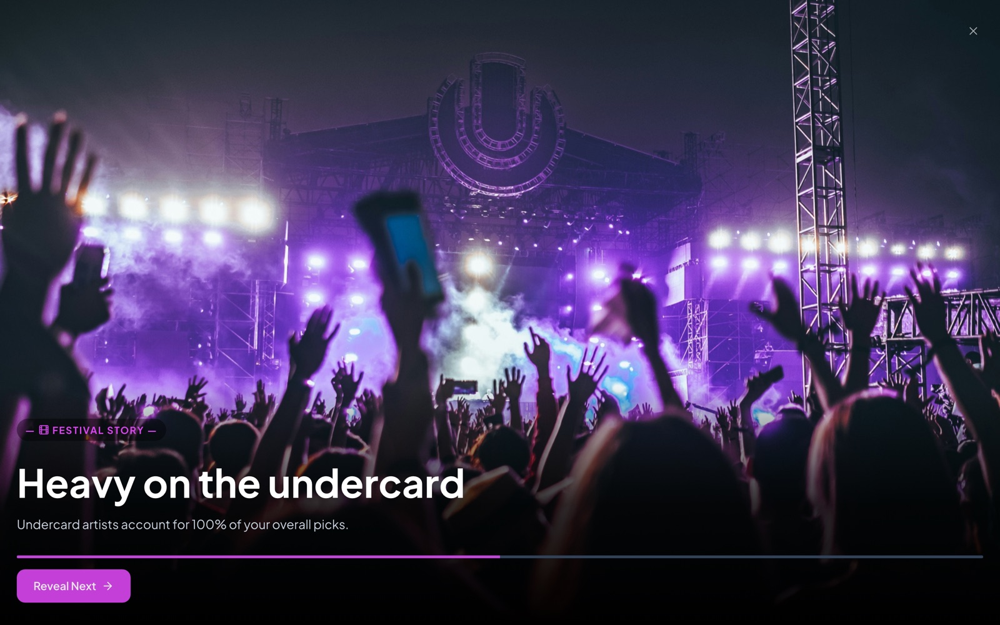

**Festival Story finale**

The closing card once a full session is complete.

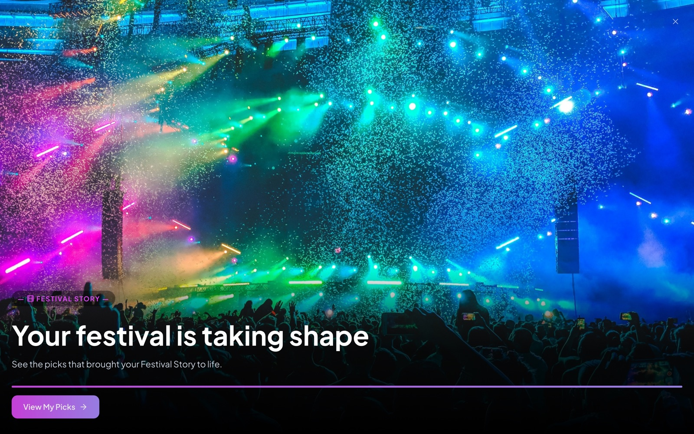

<details>
<summary>See more screens</summary>

**Quick Picks setup**

A partial day selection.

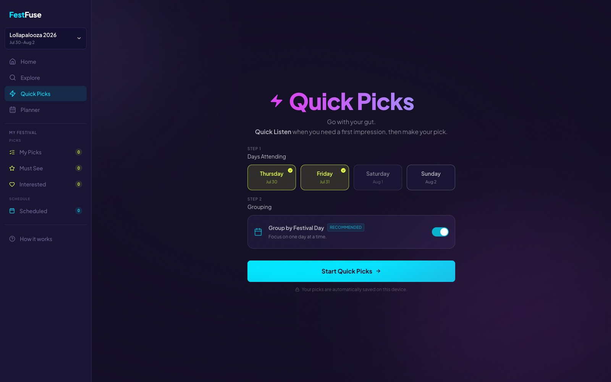

**Day complete**

The per-day milestone screen.

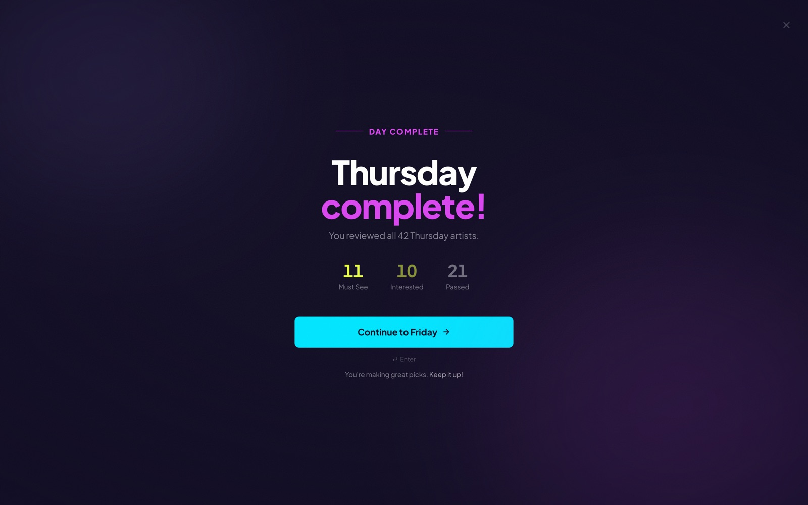

**Quick Picks complete**

End of a full session.

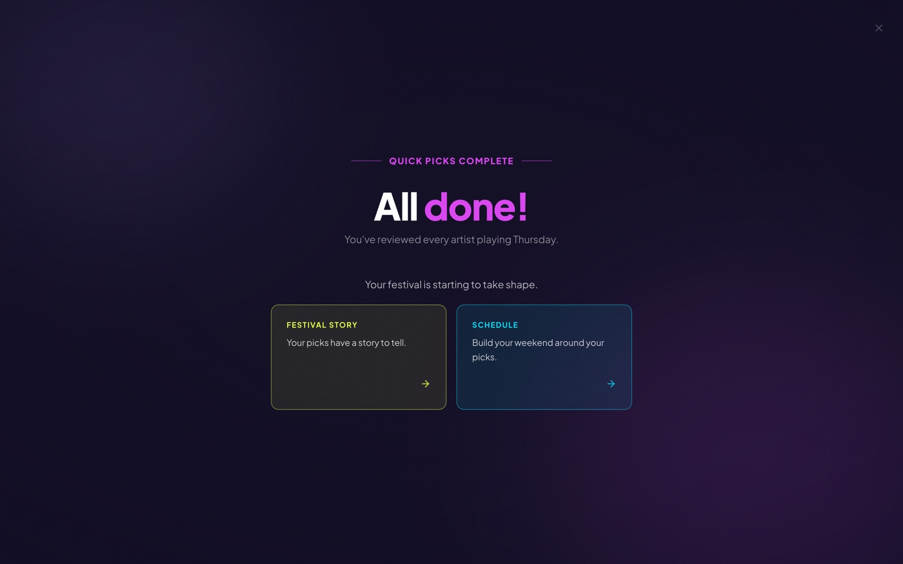

**Artist Page (About & Live Performance)**

Scrolled further down the same page: the live performance video and editorial About copy.

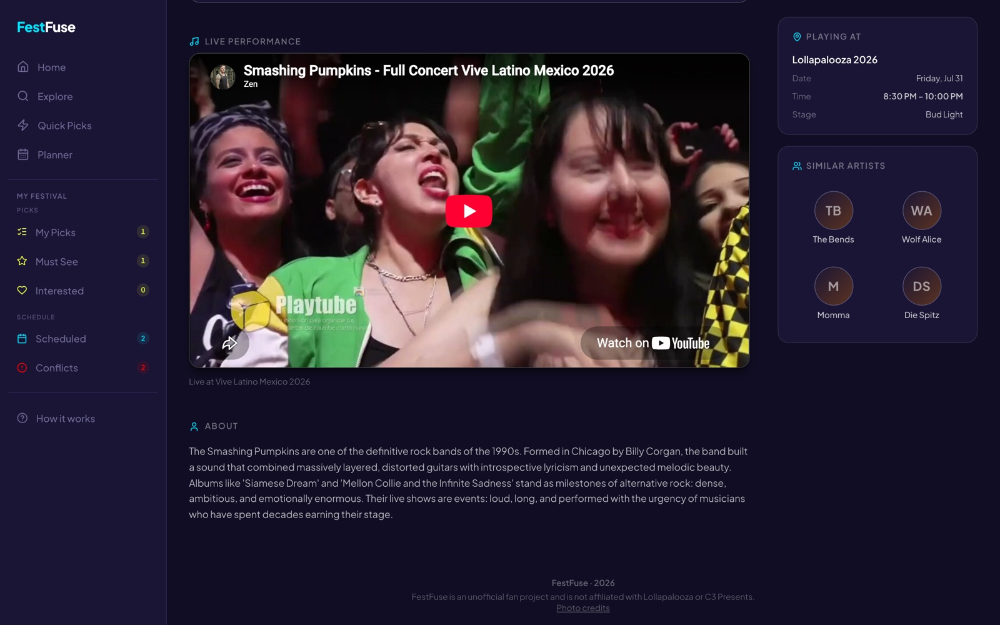

**How It Works**

The onboarding modal.

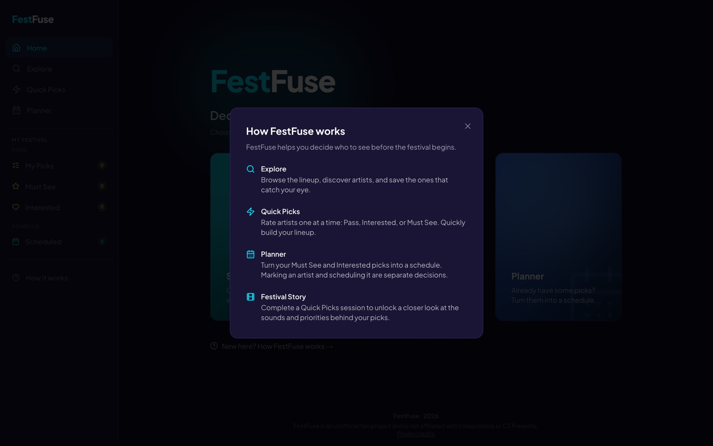

</details>

**Mobile**

<p align="center">
  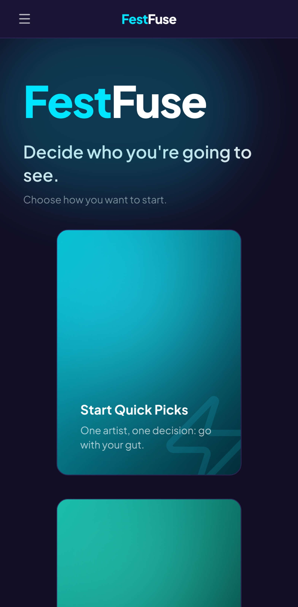
  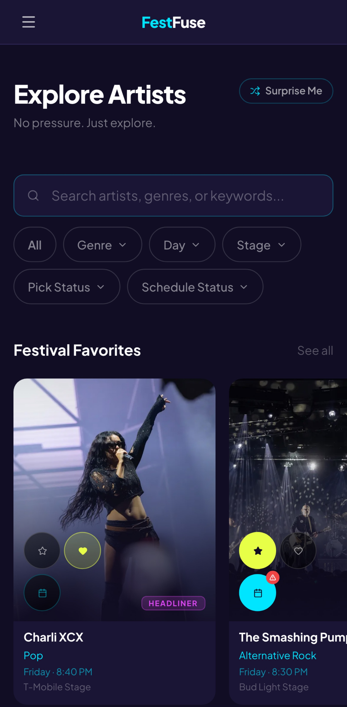
  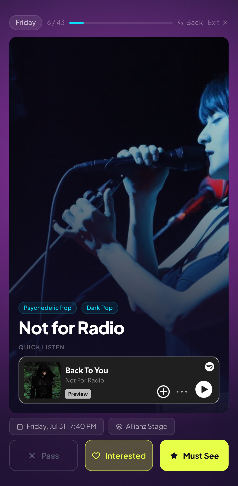
</p>

## Technical Highlights

Built with the Next.js App Router, React, TypeScript, and Tailwind CSS, with a FastAPI/PostgreSQL backend deployed on Railway.

- **PostgreSQL-backed artist data**: every artist-facing screen reads from a deployed FastAPI/PostgreSQL backend with a normalized artist schema and PostgreSQL integration tests. Artist records are authored directly in the database through small transactional CLI workflows, backed by an editorial research-and-review process.
- **Festival Story's insight engine** computes a personalized recap from the user's actual attendance scope and picks each time, instead of displaying a fixed or randomly generated script.
- **Multi-appearance modeling** lets a repeat festival performance exist as its own scoped appearance record instead of duplicating the artist, so the same artist can play multiple sets without the two copies drifting out of sync.
- **Rehydration resilience**: fixed three separate causes of a blank-screen bug on page load, each traced back to how a returning user's saved picks were being restored from the browser, not patched over ([details](ARCHITECTURE.md#hydrationgate-resilience-to-rehydration-errors)).

A few more decisions worth knowing about:

- Normalizes 123 genres into 10 parent categories, powering genre pills, Explore filtering, and the gradient-fallback theming used when an artist has no photo.
- Detects real schedule conflicts across a user's scheduled picks, scoped by festival and calendar date.
- Uses deterministic carousel sampling to keep server and client rendering consistent while preserving variety between visits.
- Persists decisions and schedule state in the browser with Zustand.
- Gates AI-drafted artist bios and similar-artist picks behind a verified flag, so unverified content never renders. All 171 artists' similar-artist picks are verified; bio verification is ongoing.

For deeper implementation notes and design decisions, see [ARCHITECTURE.md](ARCHITECTURE.md).

## Tech Stack

**Frontend**

- [Next.js 16](https://nextjs.org/)
- [React 19](https://react.dev/)
- [TypeScript](https://www.typescriptlang.org/)
- [Tailwind CSS 4](https://tailwindcss.com/)
- [Zustand](https://zustand.docs.pmnd.rs/)
- [Motion](https://motion.dev/)
- [Vercel Analytics](https://vercel.com/docs/analytics)
- Spotify and YouTube embeds

**Backend and data**

- [FastAPI](https://fastapi.tiangolo.com/)
- [PostgreSQL](https://www.postgresql.org/)
- [SQLAlchemy 2](https://www.sqlalchemy.org/)
- [Psycopg 3](https://www.psycopg.org/psycopg3/)
- [Alembic](https://alembic.sqlalchemy.org/) migrations

**Testing and quality**

- [pytest](https://docs.pytest.org/) route and PostgreSQL integration tests
- [Ruff](https://docs.astral.sh/ruff/) Python linting and formatting
- ESLint and Prettier

## Getting Started

### Prerequisites

- Node.js and npm
- For the backend: Python 3.14, PostgreSQL 16+, and (for a rebuild from a dump) the
  `pg_dump` / `pg_restore` client tools

### Installation

```bash
git clone https://github.com/brian-quiroz/festfuse.git
cd festfuse
npm install
npm run dev
```

Open [http://localhost:3000](http://localhost:3000) in your browser.

`npm run dev` runs against the hosted backend by default, no environment variables
are required for that path. To run or bootstrap the FastAPI/PostgreSQL backend
locally, see [local development](docs/operations/local-development.md).

## Available Scripts

```bash
npm run dev          # Start the development server
npm run build        # Create a production build
npm run start        # Run the production build
npm run lint         # Run ESLint
npm run format       # Format the project with Prettier
npm run verify:story # Verify Festival Story signal invariants
```

Backend test commands and the distinction between isolated API tests and real
PostgreSQL integration tests are documented in the
[backend testing guide](backend/tests/README.md).

## Current Scope and Roadmap

FestFuse covers the Lollapalooza 2026 lineup and reads all artist data from its
FastAPI/PostgreSQL backend. The next iteration
([`docs/roadmap/multi-festival.md`](docs/roadmap/multi-festival.md)) focuses on:

- Multiple festivals, including editions that run more than one weekend
  (Austin City Limits 2026 is the target)
- Supporting an announced lineup before its schedule is published
- Expanding frontend and backend automated test coverage

User accounts and artist comparison are not planned for this iteration.

## Project Structure

```text
docs/                    # Decision records, roadmaps, design and process notes, screenshots
backend/                 # FastAPI, SQLAlchemy models, Alembic migrations, and tests
app/
├── artist/[slug]/       # Artist detail routes
├── components/          # Shared and feature-specific UI
├── data/                # Festival config, category vocabularies, and story data
├── explore/             # Lineup discovery
├── hooks/               # Shared React behavior and story signals
├── lib/                 # Search, filtering, scheduling, and sampling logic
├── planner/             # Festival schedule builder
├── quick-picks/         # Guided artist decision flow
├── store/               # Zustand client state
└── types/               # Shared TypeScript models
```

## Data and Media Credits

FestFuse is an independent portfolio project and is not affiliated with Lollapalooza, C3 Presents, Spotify, YouTube, or the artists represented. Artist imagery and embedded media remain the property of their respective owners. See the in-app Credits page for detailed attributions.
